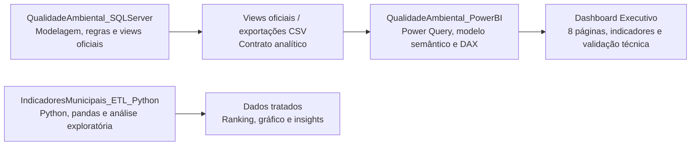

# Olá, eu sou Lucas

Sou Engenheiro Ambiental por formação, pós-graduado em Engenharia de Dados e estudante de Análise e Desenvolvimento de Sistemas.

Atualmente estou direcionando minha carreira para a área de dados e tecnologia, com foco em SQL Server, Business Intelligence, Power BI, modelagem analítica, DAX e desenvolvimento de soluções orientadas a dados.

Minha formação em Engenharia Ambiental contribuiu para desenvolver uma visão analítica e sistêmica sobre problemas complexos. Hoje aplico essa base na área de dados e tecnologia, criando soluções que conectam modelagem, indicadores, visualização e tomada de decisão em diferentes domínios de negócio.

## Foco Atual

- SQL Server
- Modelagem relacional
- Engenharia de dados
- Business Intelligence
- Power BI
- Power Query
- DAX
- Modelagem semântica
- Governança de indicadores
- Storytelling com dados
- Análise e Desenvolvimento de Sistemas
- Documentação técnica para portfólio

## Ecossistema Atual



## Projetos em Destaque

### [QualidadeAmbiental SQL Server](https://github.com/engambientalucas-design/QualidadeAmbiental_SQLServer)

Projeto de banco de dados relacional voltado ao monitoramento de qualidade ambiental, desenvolvido com foco em modelagem, regras de conformidade, views oficiais e estruturação de dados laboratoriais.

Principais pontos:

- Modelagem relacional em SQL Server.
- Organização de entidades, relacionamentos e regras de negócio.
- Criação de views oficiais para consumo analítico.
- Regras de conformidade e não conformidade tratadas na camada de banco.
- Base preparada para integração com Power BI.

Este projeto representa a camada de dados do ecossistema `QualidadeAmbiental`.

### [QualidadeAmbiental Power BI](https://github.com/engambientalucas-design/QualidadeAmbiental_PowerBI)

Dashboard analítico desenvolvido em Power BI como continuação direta do projeto SQL Server, com foco em indicadores de conformidade, parâmetros críticos, pontos de monitoramento, análise temporal, responsáveis e validação técnica.

Principais pontos:

- Consumo de dados derivados das views oficiais do SQL Server.
- Tratamento em Power Query.
- Modelo semântico com tabela fato e dimensão de data.
- Medidas DAX para indicadores de conformidade.
- Dashboard com 8 páginas analíticas.
- Análise executiva, parâmetros críticos, pontos afetados, evolução temporal e validação técnica.
- Documentação estruturada para portfólio no GitHub.

Este projeto representa a camada analítica e visual do ecossistema `QualidadeAmbiental`.

Fluxo demonstrado:

```text
SQL Server -> Views oficiais/exportações CSV -> Power Query -> Modelo Power BI -> DAX -> Dashboard Executivo
```

### [IndicadoresMunicipais ETL Python](https://github.com/engambientalucas-design/IndicadoresMunicipais_ETL_Python)

Projeto de ETL e análise exploratória em Python voltado à criação de indicadores municipais de desenvolvimento e infraestrutura.

Principais pontos:

- Leitura de dados brutos em CSV.
- Tratamento e padronização com pandas.
- Normalização de indicadores.
- Criação de índice consolidado de infraestrutura.
- Geração de ranking municipal.
- Produção de gráfico com matplotlib/seaborn.
- Documentação estruturada para portfólio.

Este projeto amplia meu portfólio para além de SQL Server e Power BI, demonstrando também domínio inicial de pipelines de dados com Python.

## O Que Estou Construindo

Atualmente estou desenvolvendo um portfólio orientado a projetos reais, com foco em:

- Separação clara entre camada de dados e camada analítica.
- Documentação técnica compreensível.
- Indicadores com governança.
- Dashboards com narrativa executiva e validação técnica.
- Versionamento com Git e publicação no GitHub.
- Pipelines de dados com Python, pandas e visualizações.

## Próximos Passos

- Evoluir projetos envolvendo ETL, análise exploratória e automação com Python.
- Evoluir dashboards com melhores práticas de UX e storytelling.
- Aprofundar modelagem dimensional e performance em SQL Server.
- Publicar estudos técnicos sobre os projetos desenvolvidos.

## Tecnologias

```text
SQL Server | Power BI | Power Query | DAX | Python | Git | GitHub
```

## Contato

Estou aberto a oportunidades, networking e conversas sobre dados, BI e desenvolvimento de soluções analíticas.
